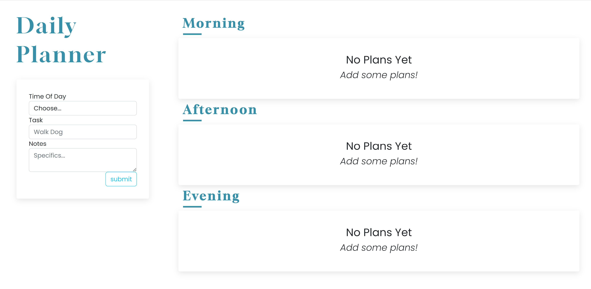
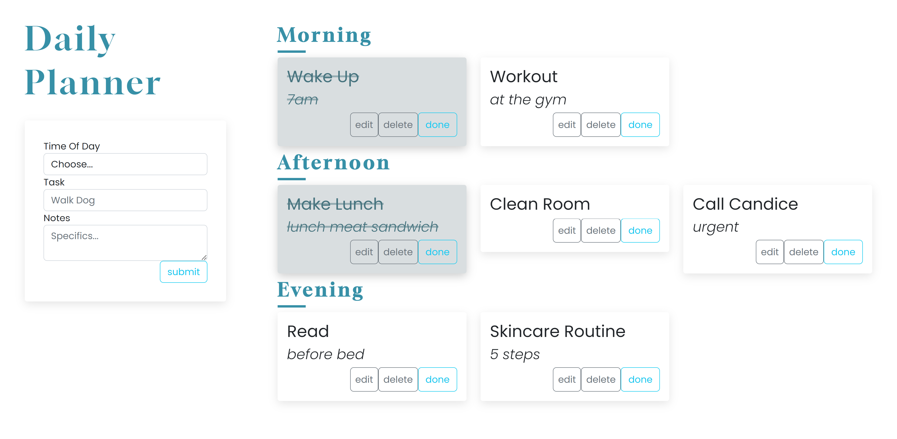
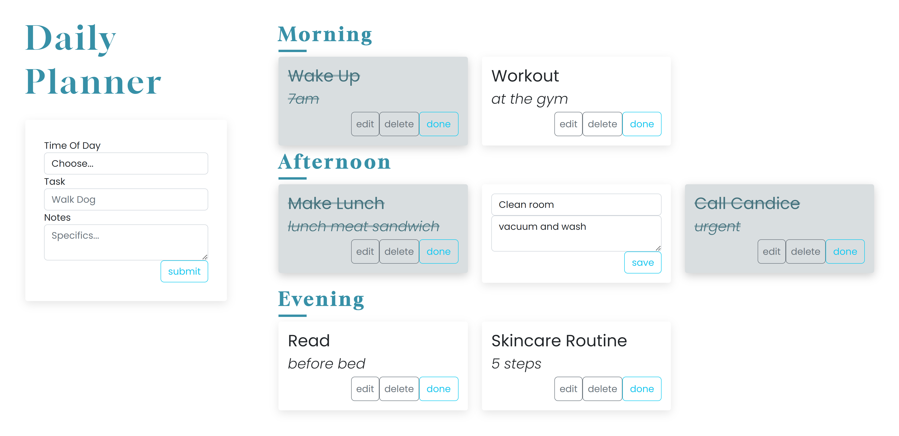
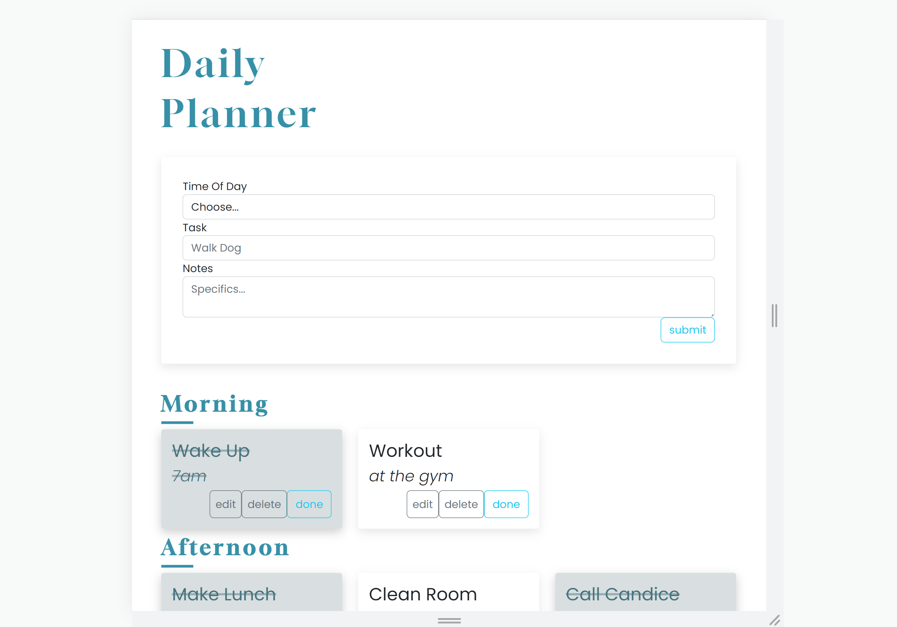
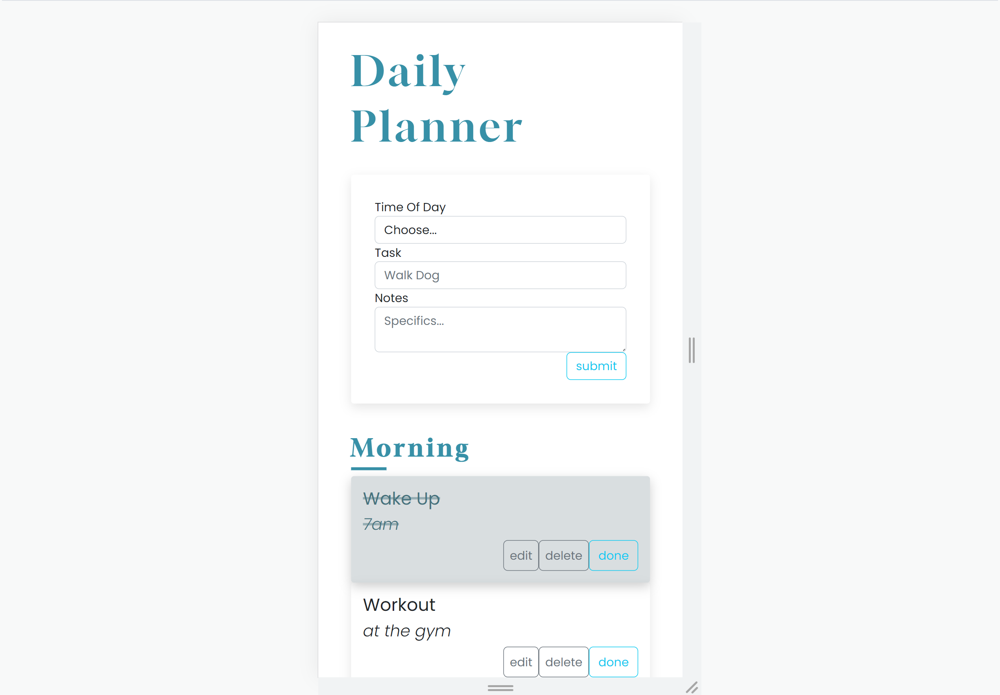

# Daily Planner App

This is a simple web application for managing your daily tasks and plans. It allows you to create, edit, and delete plans for the morning, afternoon, and evening, and mark them as done when you complete them. The application is built with React and Bootstrap 5.

## Features
- Create new plans for the morning, afternoon, and evening
- Edit existing plans
- Delete plans
- Mark plans as done

## Installation and Setup
To use this application, you need to have Node.js and npm (or yarn) installed on your system. Once you have installed these prerequisites, follow these steps:

1. Clone the repository or download the source code as a ZIP file.
2. Open a terminal or command prompt and navigate to the project directory.
3. Install the dependencies by running `npm install` or `yarn install`.
4. Start the development server by running `npm start` or `yarn start`.
5. Open your web browser and navigate to `http://localhost:3000` to view the application.

## Usage
To use the application, follow these steps:

1. On the home page, select the category for which you want to create a new plan (morning, afternoon, or evening).
2. Enter the title and notes for your new plan and click the "submit" button.
3. To edit an existing plan, click the "edit" button on the plan card, make your changes, and click the "save" button.
4. To mark a plan as done, click the "done" button on the plan card.
5. To delete a plan, click the "delete" button on the plan card.

## Responsive Design

## Contributing
If you find a bug or have a suggestion for improving the application, please open an issue or submit a pull request on GitHub. Contributions are always welcome!

## License
This application is licensed under the MIT License. See the `LICENSE` file for details.

## Credits
This application was created by Isyss S. Special thanks to the creators of React and Bootstrap for making this project possible.

